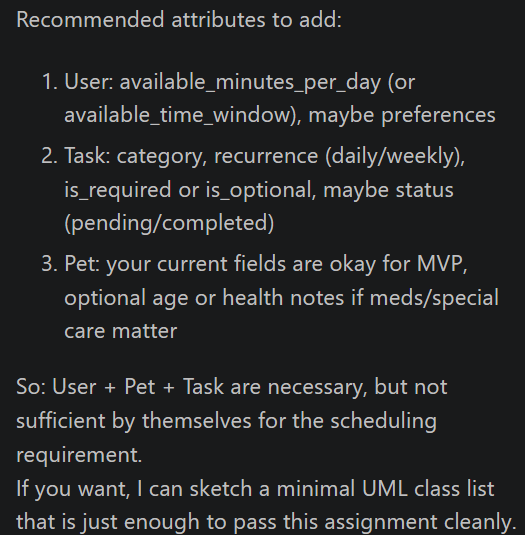
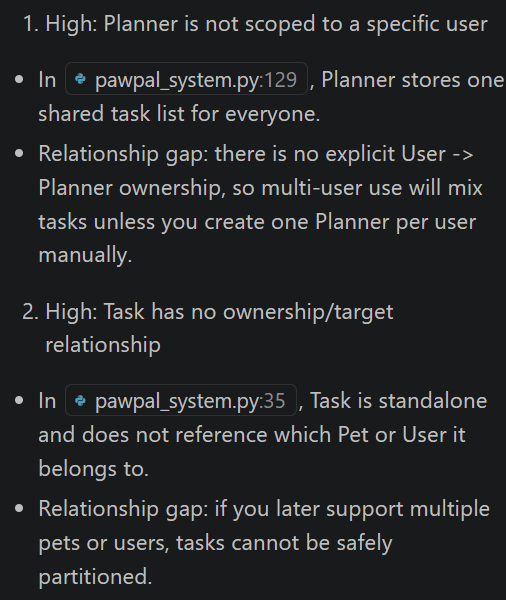
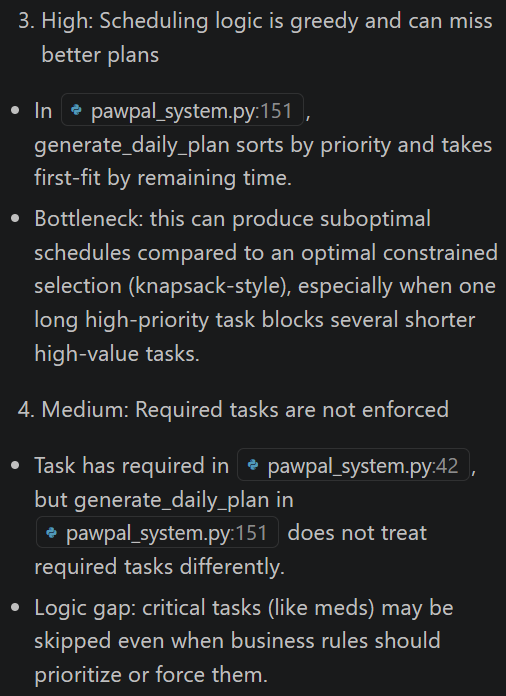
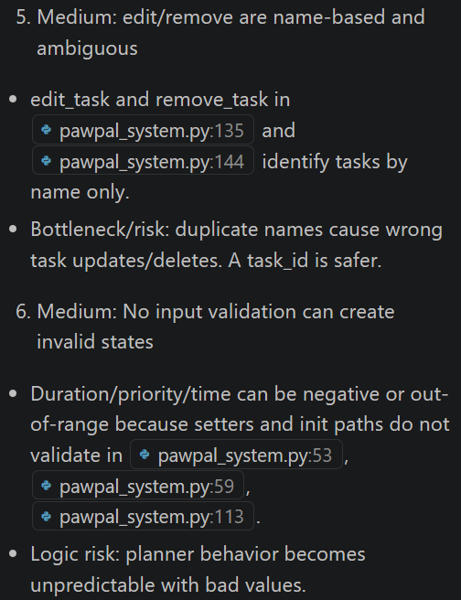
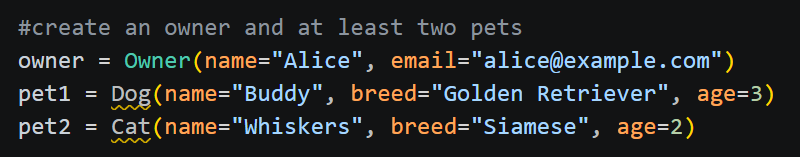
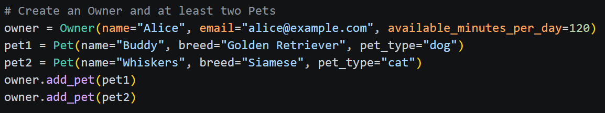

# PawPal+ Project Reflection

## 1. System Design

**a. Initial design**

- Briefly describe your initial UML design.
- What classes did you include, and what responsibilities did you assign to each?

My initial UML diagram had the following classes with attributes and methods:

User class with attributes: name, email, password, and pet, plus general getters and setters.

Pet class with attributes: name, breed, and type, plus general getters and setters.

Task class with attributes: name, priority, and duration, plus general getters and setters.

In my initial design, the User class was responsible for holding user data and linking to pet information.

The Pet class was responsible for holding pet-specific data.

The Task class was responsible for holding task data and supporting updates/modifications to tasks.

**b. Design changes**

- Did your design change during implementation?
- If yes, describe at least one change and why you made it.

After asking Copilot to review my initial design, I realized I was missing a Scheduler/Planner class, constraints like available time per day, and task behavior methods like add, edit, remove, and list. So I updated the UML to include those pieces.

Then I asked Copilot to check for missing relationships and potential logic bottlenecks. Based on that review, I made additional updates:

1. Added a task_id to the Task class.
2. Added optional pet_name to better connect tasks to pets.
3. Enforced required-task-first scheduling.
4. Added validation for constraints (like non-negative duration and bounded priority).
5. Made the Planner explicitly connected to a specific User.
6. These changes made the design more complete and better aligned with the scheduling requirements of the project. 

---

## 2. Scheduling Logic and Tradeoffs

**a. Constraints and priorities**

- What constraints does your scheduler consider (for example: time, priority, preferences)?
- How did you decide which constraints mattered most?

The scheduler considers the time constraint of the owner as well as the tasks that are required and high priority tasks. These tasks are important and need to be done before any lower-priority task and within the time constraint. This constraint mattered the most as reflected on what tasks are important and required for the user.

**b. Tradeoffs**

- Describe one tradeoff your scheduler makes.
- Why is that tradeoff reasonable for this scenario?

The schedule guarentees that the required taks are attempted first and high-priority tasks are preferred. However, it can miss combinations that would fit more total work into the available time. 

This tradeoff is reasonable as the user expects a predictable schedule for their pet and not an optimized one.  

---

## 3. AI Collaboration

**a. How you used AI**

- How did you use AI tools during this project (for example: design brainstorming, debugging, refactoring)?
- What kinds of prompts or questions were most helpful?

I used AI to gauge the efficiently of my UML diagram. I created my own UML and asked it to give me feedback based on the requirments of the project. It gave me suggestsions and after checking it out, I either accepted them or denied them. I also used AI for help with the scheduling logic improvements and conflict detection. I was a bit lost on this part and it guided me in the right direction on how to make the scheduling algorithm more efficent for the context of this program. It explained that the greedy approach was better than optimal one in this case as the user expects something predictable. 

The prompts that were the most helpful is when I provided more context and my own thoughts. For example, when creating the UML diagram, I provided my initial ideas and asked for feedback on it. AI provided a list of description of what was missing and why it was important. 

**b. Judgment and verification**

- Describe one moment where you did not accept an AI suggestion as-is.
- How did you evaluate or verify what the AI suggested?

While using in-line suggestions, AI created two pets with Dog and Cat as objects when the object should have been Pet.It also added an age to the Pet which is not attribute to the object Pet. These were verfied by the error messages that showed up under the objects "Dog" and "Cat" as well as comparing the objects to the classes that were created in pawpal_system.py. Our UML did not have "Dog" or "Cat" objects, but Pet objects. 

The suggestions were modified to match the UML diagram

---

## 4. Testing and Verification

**a. What you tested**

- What behaviors did you test?
- Why were these tests important?

1. Task Validation - This test is important priority must be 1-5 and duration of minutes must be non-negative. If this was not working correctly, it could affect the scheduler. 

2. Generate Daily Schedule - This test is important as high priority task should be dnoe first using shorter duration as a tiebreaker. If not working correctly, low-priority tasks could override a required one. It would also make sure that the tasks do not exceed the time constraint. 

3. Detect Conflicts - This test is important as required tasks need to be completed and the owner should be notified when this happens. 

**b. Confidence**

- How confident are you that your scheduler works correctly?
- What edge cases would you test next if you had more time?

I have a confidence level of 4 out of 5 stars. All 23 tests pass and the core scheduling behaviors work as expected. 

If given more time, I would test real-world scenarios with multiple pets and overlapping constraints that are not covered yet. The logic holds up well for what is tested so far.

---

## 5. Reflection

**a. What went well**

- What part of this project are you most satisfied with?

The part of the project I am most satisfied with is the UML design. My original ideas helped start the basis of the project and expanded on with the help of AI. It led to a very cohesive project. 

**b. What you would improve**

- If you had another iteration, what would you improve or redesign?

If I had another iteration, I would allow the user to input multiple pets, add a task for each pet, then create a schedule for their pets. Once the user inputs a pet, they can insert another then choose a task for their pet using a drop down menu. 

**c. Key takeaway**

- What is one important thing you learned about designing systems or working with AI on this project?

AI can be super helpful when building off the ideas you have. It is very important to develop your own idea, such as the UML for this project, and ask AI to analyze it for missing aspects that we may not have thought of. 